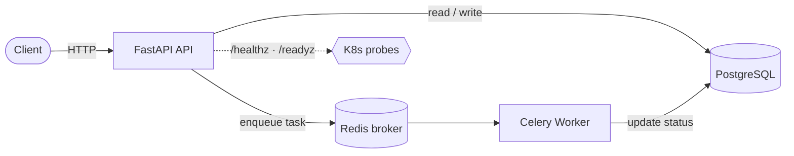

# aks-apps

A SaaS-style application and its Kubernetes delivery: a **FastAPI** REST API and a
**Celery** background worker, backed by **PostgreSQL** and **Redis**, containerized with
multi-stage Docker images and deployed to **AKS** via **Kustomize** overlays and **Argo CD** (GitOps).

> Infrastructure (AKS, networking, registry, CI) lives in its companion repo: **[aks-infra](https://github.com/talz0rs/aks-infra)**.

## Architecture



- **API** — FastAPI service: item CRUD + Kubernetes liveness/readiness probes.
- **Worker** — Celery worker for async jobs (Redis broker, PostgreSQL backing store).
- **Delivery** — multi-stage images → Kustomize base + per-env overlays (dev / staging / prod) → Argo CD (dev/staging auto-sync, prod manual sync).

## Status

| Area | State |
|---|---|
| API — item CRUD + health probes (`/healthz`, `/readyz`) | ✅ Done |
| Celery worker — background processing (Redis broker) | ✅ Done |
| Tests + CI (pytest + GitHub Actions) | ✅ Done |
| Containerization — multi-stage Docker images | ✅ Done |
| Kustomize manifests (dev / staging / prod) | ✅ Done |
| Argo CD GitOps | ⬜ Planned |

## Design notes

- **Async FastAPI** — fits I/O-bound SaaS request handling and auto-generates OpenAPI docs.
- **Celery** — offloads work that doesn't belong in the request/response cycle; Redis brokers tasks, workers process them.
- **Split liveness/readiness** — `/healthz` (process alive) drives restarts; `/readyz` (DB + Redis reachable) gates traffic.
- **Stateless app** — no state in the container (pods are ephemeral); data lives in external managed PostgreSQL/Redis.
- **Kustomize overlays** — one shared base; dev runs in-cluster Redis/PostgreSQL, staging/prod use Azure managed services. Increased resources for prod, plus HPA (api 2–10, worker 2–5, 70% CPU).

## Local development

```bash
cd src
python3 -m venv .venv && source .venv/bin/activate
pip install -r requirements.txt
uvicorn main:app --reload
# interactive API docs at http://localhost:8000/docs
```

## Tests

```bash
# from the repo root
pip install -r src/requirements-dev.txt
pytest                      # runs the suite in tests/
```

> The suite emits a Starlette deprecation warning nudging toward `httpx2` — a typosquat impersonating `httpx`.
